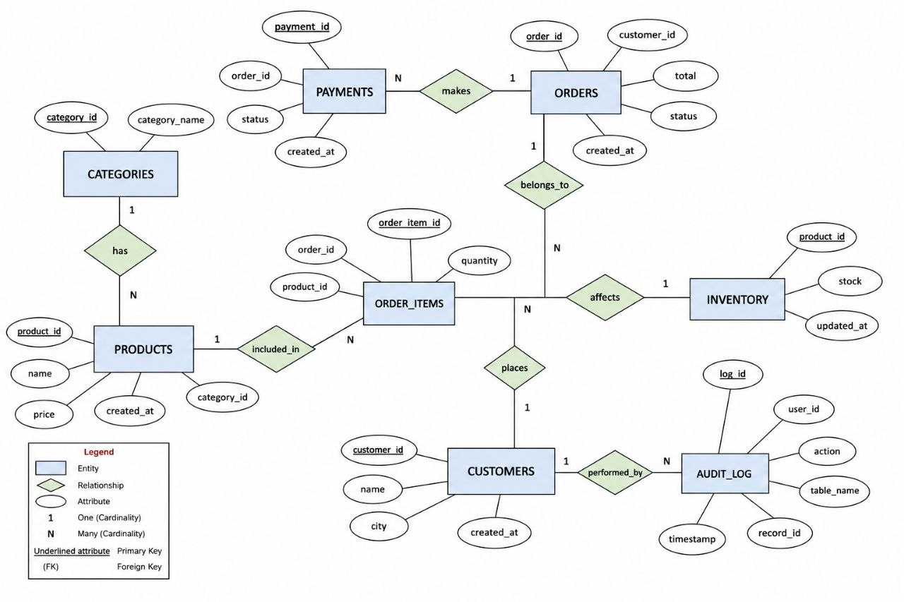

# advanced-databases
# E-Commerce Platform Database System

**Course:** Advanced Databases | ITce 2024

**Section:** A | Group 2

**Submitted to:** Ms. Birhanu

**Submission Date:** 10/09/2018 E.C

**Tool:** MySQL Workbench

---

## Group Members & GitHub Contributions

| No | Name | ID Number | File |
|----|------|-----------|------|
| 1 | AFRANO KINATO | MTUUR/8919/17 | `01_create_tables.sql` |
| 2 | AMANUEL DERIGISA | MTUUR/8970/17 | `02_insert_data.sql` |
| 3 | BAYE ASNAKE | MTUUR/8832/17 | `03_normalization.sql` |
| 4 | BEWKET ABIE | MTUUR/7822/17 | `04_optimized_queries.sql` |
| 5 | BEZAWIT BETROS | MTUUR/7776/17 | `05_transactions.sql` |
| 6 | HUSSEN OMERE | MTUUR/7787/17 | `06_isolation_levels.sql` |
| 7 | ADANE DIGA | MTUUR/8415/17 | `07_rbac_security.sql` |
| 8 | BELAY TESHOME | MTUUR/8606/17 | `08_encryption.sql` |
| 9 | BINIYAM BIYDIGIE | MTUUR/7866/17 | `09_audit_log.sql` |
| 10 | ETHIOPIA WORKU | MTUUR/8567/17 | `10_distributed_design.sql` |
| 11 | HAMDU IDRIS | MTUUR/8293/17 | `11_failure_recovery.sql` |

---

## How to Run the Project

Run the files **in order** in MySQL Workbench:

```
1.  01_create_tables.sql       → Creates all database tables
2.  02_insert_data.sql         → Inserts sample data
3.  03_normalization.sql       → Demonstrates UNF → 1NF → 2NF → 3NF
4.  04_optimized_queries.sql   → Runs optimized SELECT queries with indexes
5.  05_transactions.sql        → Runs COMMIT and ROLLBACK transactions
6.  06_isolation_levels.sql    → Demonstrates concurrency isolation levels
7.  07_rbac_security.sql       → Creates roles and grants permissions
8.  08_encryption.sql          → Demonstrates AES encryption and password hashing
9.  09_audit_log.sql           → Creates audit log and fraud detection queries
10. 10_distributed_design.sql  → Distributed sharding and replication design
11. 11_failure_recovery.sql    → WAL, checkpointing, backup and ARIES recovery
```

---

## Table of Contents

1. [Introduction](#1-introduction)
2. [Background of the Study](#11-background-of-the-study)
3. [Problem Statement](#12-problem-statement)
4. [Objectives](#13-objectives-of-the-project)
5. [Scope of the System](#14-scope-of-the-system)
6. [System Requirements](#15-system-requirements)
7. [ER Diagram Explanation](#2-er-diagram-explanation)
8. [Database Schema (DDL)](#sql-ddl-scripts)
9. [Sample Data (DML)](#sample-data-dml)
10. [Normalization (UNF → 3NF)](#3-normalization-form-nf)
11. [Optimized SQL Queries](#4-optimized-sql-queries)
12. [Transactions & Concurrency](#5-transactions--concurrency)
13. [Security & Access Control](#6-security--access-control)
14. [Distributed Database Design](#7-distributed-database-design)
15. [Failure Recovery](#8-failure-recovery)
16. [Conclusion](#conclusion)
17. [References](#references)

---

## 1. Introduction

Electronic commerce (E-Commerce) has become one of the most important sectors in the modern digital economy. Businesses around the world are increasingly using online platforms to sell products and services because they provide faster communication, wider market access, and better customer convenience. In Ethiopia, the rapid growth of internet access, smartphones, mobile banking, and digital payment systems such as Telebirr has encouraged many businesses to move toward online commerce platforms.

Modern E-Commerce systems require powerful and reliable database systems capable of handling large amounts of data and thousands of simultaneous users. These systems must support product management, customer registration, online ordering, secure payment processing, inventory tracking, logistics coordination, and reporting functionalities.

This project focuses on designing and implementing an advanced database system for a scalable E-Commerce platform operating across multiple cities in Ethiopia: **Addis Ababa**, **Adama**, and **Hawassa**.

---

## 1.1 Background of the Study

The development of information technology has transformed traditional business operations into digital business environments. In Ethiopia, the adoption of digital financial technologies such as Telebirr, mobile banking, and online payment services has increased significantly in recent years.

Traditional database systems are often unable to efficiently manage:

- Large numbers of concurrent users
- Real-time inventory updates
- Distributed business operations
- Secure online transactions
- Fast product searching and filtering
- High traffic during promotional sales

Advanced database systems solve these challenges through techniques such as normalization, indexing, concurrency control, distributed database management, replication, backup strategies, and recovery mechanisms.

---

## 1.2 Problem Statement

Some of the major challenges faced by E-Commerce platforms include:

- Overselling products due to concurrent purchases
- Maintaining real-time inventory consistency across multiple users
- Managing secure payment transactions
- Handling high traffic during promotions and holidays
- Preventing unauthorized access and fraud
- Managing distributed operations across multiple cities
- Recovering data after system failures or crashes
- Optimizing query performance for product searches and reports

**Example:** When multiple customers attempt to purchase the same limited-stock product simultaneously, poor transaction management may cause negative inventory values or duplicate orders.

---

## 1.3 Objectives of the Project

### General Objective
To design and implement a scalable, secure, and distributed advanced database system for a modern E-Commerce platform operating across multiple cities in Ethiopia.

### Specific Objectives

- Design a fully normalized relational database schema
- Implement secure payment processing mechanisms
- Support concurrent transaction processing for multiple users
- Prevent overselling of products during simultaneous purchases
- Optimize product search and reporting queries
- Implement role-based access control and security mechanisms
- Maintain audit logs for monitoring user activities and transactions
- Design a distributed database architecture across multiple regions
- Implement backup, checkpointing, and failure recovery strategies
- Ensure ACID compliance for transaction processing

---

## 1.4 Scope of the System

| Area | Features |
|------|----------|
| Customer Management | Registration, login, profile management |
| Product Management | Listing, categorization, search, inventory tracking |
| Order Management | Cart, placement, tracking, status updates |
| Payment Processing | Telebirr, bank transfer, cash on delivery |
| Inventory Management | Real-time stock updates, low-stock alerts |
| Security | Password hashing, AES encryption, RBAC, audit logging |
| Distributed DB | Regional sharding, replication, distributed transactions |
| Failure Recovery | WAL, checkpointing, backup & restore, ARIES |

Cities covered: **Addis Ababa · Adama · Hawassa**

---

## 1.5 System Requirements

**Hardware:** Intel Core i5, 8 GB RAM, SSD storage, stable internet connection

**Software:** MySQL or PostgreSQL, Windows or Linux OS, MySQL Workbench or pgAdmin

**Database Features Required:** ACID transactions, replication, concurrency control, indexing, backup/recovery, RBAC

### Feasibility Study

| Type | Assessment |
|------|------------|
| Technical | Modern RDBMS fully supports all required features |
| Economic | Open-source tools minimize cost |
| Operational | Improves order processing, inventory, and reporting |

### Functional Requirements

- Allow customers to register and login securely
- Support online ordering and payments
- Automatically update inventory after purchases
- Generate sales reports and maintain audit logs
- Support concurrent users efficiently

### Non-Functional Requirements

High performance · Scalability · Reliability · Security · Availability · Data consistency · Fault tolerance

---

## 2. ER Diagram Explanation

| Entity | Key Attributes | Relationship |
|--------|---------------|--------------|
| Customers | customer_id, name, email, phone, city | One customer → many orders |
| Categories | category_id, category_name | One category → many products |
| Products | product_id, name, price, category_id | Each product belongs to one category |
| Inventory | product_id, stock | One record per product |
| Orders | order_id, customer_id, total, status | One customer → many orders |
| Order_Items | order_item_id, order_id, product_id, quantity | One order → many items |
| Payments | payment_id, order_id, method, status | One payment per order |
| Audit_Log | log_id, user_id, action, table_name, timestamp | Records all user activity |

---

*** Relational schema (logical ER_Diagram)***

## SQL DDL Scripts

> **Member 1 — Afrano Kinato** | File: `01_create_tables.sql`

```sql
CREATE DATABASE E_COMMERCE;
USE E_COMMERCE;

CREATE TABLE Customers (
    customer_id INT PRIMARY KEY,
    name        VARCHAR(100),
    city        VARCHAR(100),
    created_at  TIMESTAMP DEFAULT CURRENT_TIMESTAMP
);

CREATE TABLE Categories (
    category_id   INT PRIMARY KEY,
    category_name VARCHAR(100)
);

CREATE TABLE Products (
    product_id  INT PRIMARY KEY,
    name        VARCHAR(100),
    category_id INT,
    price       DECIMAL(10,2),
    created_at  TIMESTAMP DEFAULT CURRENT_TIMESTAMP,
    FOREIGN KEY (category_id) REFERENCES Categories(category_id)
);

CREATE TABLE Inventory (
    product_id INT PRIMARY KEY,
    stock      INT,
    updated_at TIMESTAMP DEFAULT CURRENT_TIMESTAMP,
    FOREIGN KEY (product_id) REFERENCES Products(product_id)
);

CREATE TABLE Orders (
    order_id    INT PRIMARY KEY,
    customer_id INT,
    total       DECIMAL(10,2),
    status      VARCHAR(50),
    created_at  TIMESTAMP DEFAULT CURRENT_TIMESTAMP,
    FOREIGN KEY (customer_id) REFERENCES Customers(customer_id)
);

CREATE TABLE Order_Items (
    order_item_id INT PRIMARY KEY,
    order_id      INT,
    product_id    INT,
    quantity      INT,
    FOREIGN KEY (order_id)   REFERENCES Orders(order_id),
    FOREIGN KEY (product_id) REFERENCES Products(product_id)
);

CREATE TABLE Payments (
    payment_id INT PRIMARY KEY,
    order_id   INT,
    method     VARCHAR(50),
    status     VARCHAR(50),
    created_at TIMESTAMP DEFAULT CURRENT_TIMESTAMP,
    FOREIGN KEY (order_id) REFERENCES Orders(order_id)
);

CREATE TABLE Audit_Log (
    log_id     INT PRIMARY KEY,
    user_id    INT,
    action     VARCHAR(100),
    table_name VARCHAR(50),
    record_id  INT,
    timestamp  TIMESTAMP DEFAULT CURRENT_TIMESTAMP,
    FOREIGN KEY (user_id) REFERENCES Customers(customer_id)
);
```

---

## Sample Data (DML)

> **Member 2 — Amanuel Derigisa** | File: `02_insert_data.sql`

```sql
USE E_COMMERCE;

INSERT INTO Categories (category_id, category_name) VALUES
(1, 'Electronics'), (2, 'Fashion');

INSERT INTO Customers (customer_id, name, city) VALUES
(1, 'Biniyam', 'Addis Ababa'),
(2, 'Baye',    'Adama'),
(3, 'Hamidu',  'Hawassa');

INSERT INTO Products (product_id, name, category_id, price) VALUES
(1, 'Laptop', 1, 15000),
(2, 'Phone',  1,  8000),
(3, 'Shoes',  2,  1200);

INSERT INTO Inventory (product_id, stock) VALUES
(1, 10), (2, 20), (3, 50);

INSERT INTO Orders (order_id, customer_id, total, status) VALUES
(1, 1, 8000,  'Delivered'),
(2, 2, 15000, 'Pending');

INSERT INTO Order_Items (order_item_id, order_id, product_id, quantity) VALUES
(1, 1, 2, 1),
(2, 2, 1, 1);

INSERT INTO Payments (payment_id, order_id, method, status) VALUES
(1, 1, 'Telebirr',         'Completed'),
(2, 2, 'Cash on Delivery', 'Pending');

INSERT INTO Audit_Log (log_id, user_id, action, table_name, record_id) VALUES
(1, 1, 'Placed Order',      'Orders',   1),
(2, 1, 'Payment Completed', 'Payments', 1),
(3, 2, 'Created Order',     'Orders',   2);
```

**Verified output tables:**

| customer_id | name | city | created_at |
|-------------|------|------|------------|
| 1 | Biniyam | Addis Ababa | 4/18/2026 13:07 |
| 2 | Baye | Adama | 4/18/2026 13:07 |
| 3 | Hamidu | Hawassa | 4/18/2026 13:07 |

| product_id | name | category_id | price |
|------------|------|-------------|-------|
| 1 | Laptop | 1 | 15000 |
| 2 | Phone | 1 | 8000 |
| 3 | Shoes | 2 | 1200 |

---

## 3. Normalization Form (NF)

> **Member 3 — Baye Asnake** | File: `03_normalization.sql`

### Unnormalized Form (UNF)

A table is in UNF when it contains repeating groups, multi-valued attributes, or no defined primary key.

**UNF Table: Orders_Flat**

| OrderID | CustomerName | CustomerCity | ProductName | ProductPrice | CategoryName | Quantity |
|---------|-------------|--------------|-------------|--------------|--------------|----------|
| 1 | Biniyam | Addis Ababa | Phone | 8000 | Electronics | 1 |
| 2 | Baye | Adama | Laptop | 15000 | Electronics | 1 |
| 3 | Hamidu | Hawassa | Shoes | 1200 | Fashion | 2 |
| 3 | Hamidu | Hawassa | Phone | 8000 | Electronics | 1 |

> ⚠️ Customer Hamidu appears twice because Order 3 has two items — classic repeating-group violation.

---

### First Normal Form (1NF)

**Rules:** Atomic values · Unique rows · Primary key defined · No repeating groups

**Changes from UNF → 1NF:**
- Added composite primary key: `(OrderID, OrderItemID)`
- Each order item gets its own row

**1NF Table: Orders_1NF**

| OrderID | OrderItemID | CustomerName | City | ProductID | ProductName | Price | Quantity |
|---------|-------------|-------------|------|-----------|-------------|-------|----------|
| 1 | 1 | Biniyam | Addis Ababa | 2 | Phone | 8000 | 1 |
| 2 | 2 | Baye | Adama | 1 | Laptop | 15000 | 1 |
| 3 | 3 | Hamidu | Hawassa | 3 | Shoes | 1200 | 2 |
| 3 | 4 | Hamidu | Hawassa | 2 | Phone | 8000 | 1 |

---

### Second Normal Form (2NF)

**Rule:** In 1NF + every non-key attribute fully depends on the entire primary key (no partial dependencies)

**Changes from 1NF → 2NF:**
- Created separate `Customers` table
- Created separate `Products` table
- Separated `Orders` and `Order_Items` tables

**Customers:**

| CustomerID | Name | City | created_at |
|------------|------|------|------------|
| 1 | Biniyam | Addis Ababa | 2026-04-18 |
| 2 | Baye | Adama | 2026-04-18 |
| 3 | Hamidu | Hawassa | 2026-04-18 |

**Products:**

| ProductID | Name | CategoryID | Price | created_at |
|-----------|------|------------|-------|------------|
| 1 | Laptop | 1 | 15000 | 2026-04-18 |
| 2 | Phone | 1 | 8000 | 2026-04-18 |
| 3 | Shoes | 2 | 1200 | 2026-04-18 |

---

### Third Normal Form (3NF)

**Rule:** In 2NF + no transitive dependencies (non-key → non-key must not exist)

**Changes from 2NF → 3NF:**
- Extracted `Categories` table (CategoryName depended on CategoryID, not ProductID)
- Extracted `Inventory` table (stock has its own update lifecycle)
- Extracted `Payments` table (payment info is independent of order attributes)
- Extracted `Audit_Log` table (cross-cutting concern)

**Final 3NF Schema:**

| Table | Primary Key | Foreign Keys |
|-------|-------------|--------------|
| Categories | category_id | — |
| Customers | customer_id | — |
| Products | product_id | category_id → Categories |
| Inventory | product_id | product_id → Products |
| Orders | order_id | customer_id → Customers |
| Order_Items | order_item_id | order_id → Orders, product_id → Products |
| Payments | payment_id | order_id → Orders |
| Audit_Log | log_id | user_id → Customers |

**Categories (extracted from Products):**

| CategoryID | CategoryName |
|------------|--------------|
| 1 | Electronics |
| 2 | Fashion |

**Inventory (extracted from Products):**

| ProductID | Stock | updated_at |
|-----------|-------|------------|
| 1 | 10 | 2026-04-18 |
| 2 | 20 | 2026-04-18 |
| 3 | 50 | 2026-04-18 |

---

## 4. Optimized SQL Queries

> **Member 4 — Bewket Abie** | File: `04_optimized_queries.sql`

### Query 1: Product Search (by category, price range, keyword)

```sql
SELECT product_id, name, price, stock
FROM   Products
WHERE  category_name = 'Electronics'
  AND  price BETWEEN 5000 AND 20000
  AND  name LIKE '%Laptop%'
ORDER  BY price ASC;
```

### Query 2: Top-Selling Products

```sql
SELECT p.product_id, p.name, SUM(oi.quantity) AS total_sold
FROM   Products    p
JOIN   Order_Items oi ON p.product_id = oi.product_id
GROUP  BY p.product_id, p.name
ORDER  BY total_sold DESC
LIMIT  5;
```

### Query 3: Customer Order History

```sql
SELECT o.order_id, o.total, o.status, o.created_at, p.method
FROM   Orders   o
LEFT JOIN Payments p ON o.order_id = p.order_id
WHERE  o.customer_id = 1
ORDER  BY o.created_at DESC;
```

### Query 4: Daily / Monthly Revenue Report

```sql
SELECT CAST(created_at AS DATE) AS order_date,
       SUM(total) AS daily_revenue
FROM   Orders
WHERE  status = 'Delivered'
  AND  created_at >= '2026-05-01 00:00:00'
  AND  created_at <= '2026-05-31 23:59:59'
GROUP  BY CAST(created_at AS DATE)
ORDER  BY order_date DESC;
```

### Query 5: Low-Stock Alerts

```sql
SELECT product_id, name, stock
FROM   Products
WHERE  stock < 5;
```

### Indexes Created

```sql
CREATE INDEX idx_products_search  ON Products (category_id, price);
CREATE INDEX idx_orders_customer  ON Orders   (customer_id, created_at DESC);
CREATE INDEX idx_orders_revenue   ON Orders   (status, created_at);
```

### Performance Improvements

| Technique | Benefit |
|-----------|---------|
| Index Range Scan | Queries 1 & 4 skip full table scans |
| Hash Join | Query 2 matches Products ↔ Order_Items in memory |
| Sargability | Query 4 uses `>=` / `<=` instead of `DATE()` to allow index use |
| No `SELECT *` | Reduces data payload across regional network nodes |

---

## 5. Transactions & Concurrency

> **Members 5 & 6 — Bezawit Betros & Hussen Omere** | Files: `05_transactions.sql`, `06_isolation_levels.sql`

### ACID Properties

| Property | Meaning |
|----------|---------|
| Atomicity | All steps succeed or none do |
| Consistency | Database rules always remain valid (stock never goes negative) |
| Isolation | Concurrent transactions do not interfere |
| Durability | Committed data survives crashes |

### Concurrent Transaction Scenario

**Product: Laptop (product_id = 1) | Stock: 1 unit**

Two customers try to buy the last Laptop simultaneously:

| Transaction A (Biniyam) | Transaction B (Baye) |
|------------------------|----------------------|
| BEGIN; | |
| SELECT stock ... → 1 | |
| | BEGIN; |
| | SELECT stock ... → 1 ← stale! |
| UPDATE stock = stock - 1; | |
| COMMIT; → stock = 0 | |
| | UPDATE stock = stock - 1; |
| | COMMIT; → stock = **-1** ❌ OVERSOLD |

### Concurrency Problems & Fixes

**1. Lost Update** — Two transactions overwrite each other's changes.
```sql
-- Fix: Use FOR UPDATE to lock the row
SELECT stock FROM Inventory WHERE product_id = 1 FOR UPDATE;
```

**2. Dirty Read** — Reading uncommitted data from another transaction.
```sql
-- Fix: Use READ COMMITTED isolation
SET TRANSACTION ISOLATION LEVEL READ COMMITTED;
```

**3. Non-Repeatable Read** — Same SELECT returns different results within one transaction.
```sql
-- Fix: Use REPEATABLE READ or SERIALIZABLE
SET TRANSACTION ISOLATION LEVEL REPEATABLE READ;
```

### Isolation Levels

| Level | Dirty Read | Non-Repeatable Read | Phantom Read | Used For |
|-------|-----------|---------------------|--------------|----------|
| READ COMMITTED | ✓ Prevented | ✗ Possible | ✗ Possible | Product browsing, reports |
| SERIALIZABLE | ✓ Prevented | ✓ Prevented | ✓ Prevented | Checkout, payment |

### Successful Order — COMMIT

```sql
SET TRANSACTION ISOLATION LEVEL SERIALIZABLE;
BEGIN;
    SELECT stock FROM Inventory WHERE product_id = 2 FOR UPDATE;
    UPDATE Inventory SET stock = stock - 1 WHERE product_id = 2 AND stock > 0;
    INSERT INTO Orders (order_id, customer_id, total, status)
        VALUES (3, 3, 8000, 'Pending');
    INSERT INTO Order_Items (order_item_id, order_id, product_id, quantity)
        VALUES (3, 3, 2, 1);
    INSERT INTO Payments (payment_id, order_id, method, status)
        VALUES (3, 3, 'Telebirr', 'Completed');
    INSERT INTO Audit_Log (log_id, user_id, action, table_name, record_id)
        VALUES (4, 3, 'Placed Order', 'Orders', 3);
COMMIT;
```

### Failed Payment — ROLLBACK

```sql
SET TRANSACTION ISOLATION LEVEL SERIALIZABLE;
BEGIN;
    SELECT stock FROM Inventory WHERE product_id = 1 FOR UPDATE;
    UPDATE Inventory SET stock = stock - 1 WHERE product_id = 1;
    INSERT INTO Orders (order_id, customer_id, total, status)
        VALUES (4, 2, 15000, 'Pending');
    -- Payment fails
ROLLBACK;  -- All changes reversed, stock restored
```

---

## 6. Security & Access Control

> **Members 7 & 8 — Adane Diga & Belay Teshome** | Files: `07_rbac_security.sql`, `08_encryption.sql`

### Role-Based Access Control (RBAC)

| Role | Who Uses It | Access Level |
|------|-------------|--------------|
| Admin | Database Administrator | Full access to all tables |
| Seller | Product vendors | Manage products, inventory; view orders |
| Customer | Registered shoppers | Browse, order, pay; view own history |

```sql
-- Create roles
CREATE ROLE admin;
CREATE ROLE seller;
CREATE ROLE customer;

-- Admin: full access
GRANT ALL PRIVILEGES ON ALL TABLES IN SCHEMA public TO admin;

-- Seller: product and inventory management
GRANT ALL PRIVILEGES ON Products   TO seller;
GRANT ALL PRIVILEGES ON Inventory  TO seller;
GRANT SELECT         ON Orders     TO seller;
GRANT SELECT         ON Order_Items TO seller;

-- Customer: limited access
GRANT SELECT          ON Products    TO customer;
GRANT SELECT          ON Categories  TO customer;
GRANT SELECT, INSERT  ON Orders      TO customer;
GRANT SELECT, INSERT  ON Payments    TO customer;

-- Assign roles to users
GRANT admin    TO db_admin_user;
GRANT seller   TO seller_user;
GRANT customer TO customer_user;
```

### AES-256 Encryption for Payment Data

```sql
-- Store encrypted Telebirr payment reference
INSERT INTO Payments (payment_id, order_id, method, encrypted_reference, status)
VALUES (
    1, 1, 'Telebirr',
    AES_ENCRYPT('09-1234-5678-transaction-ref', 'platform_secret_key_256bit'),
    'Completed'
);

-- Decrypt (admin only)
SELECT payment_id, method,
       AES_DECRYPT(encrypted_reference, 'platform_secret_key_256bit') AS transaction_ref
FROM   Payments WHERE payment_id = 1;
```

### Encrypting Customer Phone Numbers

```sql
INSERT INTO Customers (customer_id, name, email, phone, city)
VALUES (
    1, 'Biniyam', 'biniyam@example.com',
    AES_ENCRYPT('0912345678', 'platform_secret_key_256bit'),
    'Addis Ababa'
);
```

---

## Member 9 — Biniyam Biydigie | `09_audit_log.sql`

### Password Hashing

Unlike encryption (reversible), hashing is a **one-way** process. Even if the database is breached, attackers cannot recover original passwords.

### Account Lockout Policy

```sql
DELIMITER $$
CREATE TRIGGER after_failed_login
AFTER UPDATE ON User_Accounts
FOR EACH ROW
BEGIN
    IF NEW.failed_attempts >= 5 THEN
        UPDATE User_Accounts
        SET    locked_until = DATE_ADD(NOW(), INTERVAL 30 MINUTE)
        WHERE  account_id   = NEW.account_id;
    END IF;
END$$
DELIMITER ;

-- Check lock status
SELECT account_id, username,
       CASE WHEN locked_until > NOW() THEN 'LOCKED' ELSE 'ACTIVE' END AS status
FROM   User_Accounts WHERE username = 'biniyam_aa';
```

### Audit Log Table

```sql
CREATE TABLE Audit_Log (
    log_id     INT PRIMARY KEY AUTO_INCREMENT,
    user_id    INT NOT NULL,
    username   VARCHAR(100),
    action     VARCHAR(100) NOT NULL,
    table_name VARCHAR(50),
    record_id  INT,
    old_value  TEXT,
    new_value  TEXT,
    ip_address VARCHAR(45),
    status     ENUM('SUCCESS', 'FAILED') DEFAULT 'SUCCESS',
    timestamp  TIMESTAMP DEFAULT CURRENT_TIMESTAMP,
    FOREIGN KEY (user_id) REFERENCES User_Accounts(account_id)
);
```

### Login Attempt Stored Procedure

```sql
DELIMITER $$
CREATE PROCEDURE log_login_attempt(
    IN p_username   VARCHAR(100),
    IN p_ip_address VARCHAR(45),
    IN p_success    BOOLEAN
)
BEGIN
    DECLARE v_user_id INT DEFAULT NULL;
    SELECT account_id INTO v_user_id
    FROM   User_Accounts WHERE username = p_username;

    INSERT INTO Audit_Log (user_id, username, action, ip_address, status)
    VALUES (v_user_id, p_username, 'LOGIN_ATTEMPT', p_ip_address,
            IF(p_success, 'SUCCESS', 'FAILED'));

    IF NOT p_success THEN
        UPDATE User_Accounts SET failed_attempts = failed_attempts + 1
        WHERE  username = p_username;
    ELSE
        UPDATE User_Accounts SET failed_attempts = 0, last_login = NOW()
        WHERE  username = p_username;
    END IF;
END$$
DELIMITER ;
```

### Fraud Detection Queries

```sql
-- Brute-force login detection (>3 failures in 1 hour)
SELECT username, ip_address, COUNT(*) AS failed_count
FROM   Audit_Log
WHERE  action = 'LOGIN_ATTEMPT' AND status = 'FAILED'
  AND  timestamp >= NOW() - INTERVAL 1 HOUR
GROUP  BY username, ip_address
HAVING COUNT(*) > 3
ORDER  BY failed_count DESC;

-- Unusual order activity (>5 orders in 1 hour)
SELECT user_id, username, COUNT(*) AS order_count
FROM   Audit_Log
WHERE  action = 'ORDER_PLACED'
  AND  timestamp >= NOW() - INTERVAL 1 HOUR
GROUP  BY user_id, username
HAVING COUNT(*) > 5;
```

---

## 7. Distributed Database Design

> **Member 10 — Ethiopia Worku** | File: `10_distributed_design.sql`

### Data Fragmentation Strategy

**Horizontal Fragmentation (Sharding):** Transactional tables (Orders, Order_Items, Payments) are partitioned by customer city.

| Fragment | Target Region | Sharding Key | Node |
|----------|--------------|--------------|------|
| Shard 1 (Central) | Addis Ababa | `shipping_city = 'Addis Ababa'` | Addis Ababa Main Hub |
| Shard 2 (East) | Adama | `shipping_city = 'Adama'` | Adama Edge Node |
| Shard 3 (South) | Hawassa | `shipping_city = 'Hawassa'` | Hawassa Edge Node |

**Full Replication:** Products and Categories are copied to all nodes — they are read-heavy but rarely updated.

### Replication Strategy

- **Multi-Master (Peer-to-Peer):** All three regional hubs replicate bidirectionally for global updates (inventory, new products).
- **Master-Slave (Primary-Replica):** Within each city, one primary handles writes; read-replicas absorb browsing traffic.

### Data Consistency Approach

| Type | Used For | Mechanism |
|------|----------|-----------|
| **Strong Consistency** | Payment authorization | Two-Phase Commit (2PC) |
| **Eventual Consistency** | Order status updates | Saga Pattern via message queue |

### CAP Theorem Analysis

| Workflow | CAP Profile | Trade-off |
|----------|------------|-----------|
| Checkout & Payments | **CP** | If Hawassa-to-Addis link drops, checkout temporarily fails — safer than overselling |
| Product Browsing | **AP** | Price sync may lag a few minutes — acceptable to keep thousands of shoppers browsing |

---

## 8. Failure Recovery

> **Member 11 — Hamdu Idris** | File: `11_failure_recovery.sql`

### Write-Ahead Logging (WAL)

> **Core Rule:** Every change must be written to the WAL log file on disk **before** modified data pages are written to the database.

When a customer places a Telebirr order:
1. Changes are written to the sequential WAL log on disk first
2. Only after log write is confirmed does the DB update main data pages
3. If a crash occurs, the WAL log is the authoritative source of truth
4. On restart, WAL log is replayed to recover all committed changes

### Checkpointing

At scheduled intervals the engine flushes dirty pages from RAM to disk, then appends a `CHECKPOINT` record to the WAL log.

| Load | Checkpoint Interval |
|------|-------------------|
| Normal operation | Every 5 minutes |
| Peak load | Every 30 seconds |
| After bulk import | Immediate manual checkpoint |

On crash recovery, only WAL entries **after the last checkpoint** need to be replayed — saving hours of recovery time.

### Backup Strategies

| Strategy | Description | Schedule |
|----------|-------------|----------|
| Full Backup | Complete database snapshot | Daily at 2:00 AM |
| Incremental Backup | Changes since last backup only | Every 6 hours |
| Point-in-Time Recovery (PITR) | WAL segments streamed to remote node | Continuous real-time |

### ARIES Crash Recovery Protocol

| Phase | What Happens | E-Commerce Example |
|-------|-------------|-------------------|
| **1. Analysis** | Scans WAL from last checkpoint; identifies committed vs. in-progress transactions | Telebirr payment T1 committed; stock-decrement T2 was interrupted |
| **2. Redo** | Replays all changes from committed transactions | T1's payment record re-applied; order status set to Paid |
| **3. Undo** | Reverses all incomplete transaction changes using before-images | T2's partial stock decrement rolled back; inventory restored |

### Data Consistency After Failure

- ✅ Inventory reflects only fully committed sales — no accidental overselling
- ✅ Every Payment record has a matching Order record — no orphans
- ✅ Offline regional nodes auto-sync their WAL changes once reconnected

---

## Conclusion

This project successfully designs a scalable, secure, and distributed database system for an Ethiopian E-Commerce platform. Key achievements:

- Clean **3NF schema** eliminating all redundancies and anomalies
- **ACID transactions** with SERIALIZABLE isolation and row-level locking to prevent overselling
- **Horizontal sharding** across Addis Ababa, Adama, and Hawassa
- **Multi-layer security**: RBAC, AES-256 encryption, password hashing, real-time fraud detection
- **WAL + ARIES recovery** ensuring data durability after any hardware or network failure

The system demonstrates how advanced database engineering supports digital financial integrations like Telebirr while maintaining top performance, security, and reliability.

---

## References

- Silberschatz, A., Korth, H. F., & Sudarshan, S. (2019). *Database System Concepts* (7th ed.). McGraw-Hill Education.
- Ramakrishnan, R., & Gehrke, J. (2003). *Database Management Systems* (3rd ed.). McGraw-Hill.
- Özsu, M. T., & Valduriez, P. (2020). *Principles of Distributed Database Systems* (4th ed.). Springer.
- Elmasri, R., & Navathe, S. B. (2015). *Fundamentals of Database Systems* (7th ed.). Pearson.
- Kleppmann, M. (2017). *Designing Data-Intensive Applications*. O'Reilly Media.
- MySQL Workbench Application.


<img src="
